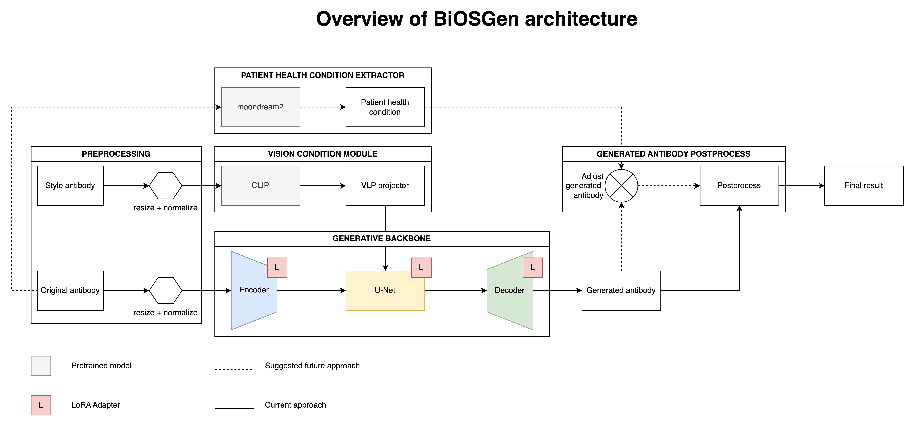

<div align="center">
  
  <a href="#"></a>
</div>

This project presents the work conducted during my first-year master's internship at the ***Paris Brain Institute*** (ICM), in association with the ***DU Sorbonne Data Analytics*** program at ***Université Paris 1 Panthéon-Sorbonne***.

The primary objective was to develop multi-scale image preprocessing and analysis techniques, as well as an integration and fusion method for image analysis. Specifically, this work focused on tumor staining style transfer from H&E to IHC images, aiming to reduce financial costs and save time for more technical analyses.

Two style transfer models were compared: one using a traditional GAN-based approach and another leveraging a more advanced diffusion-based architecture.

Future work will focus on refining the diffusion model to generate more accurate IHC images while incorporating patient-specific health factors that may influence tumor growth, progression, and treatment response.

## Model architecture
<div align="center">

  

</div>

## Project structure
```txt
BiOSGen/
│── preprocess/            
│   ├── __init__.py              
│   ├── tissue_mask.py      
│   ├── utils.py  
│── osgen/                   
│   ├── __init__.py             
│   ├── dataloader.py   
│   ├── loss.py
│   ├── nn.py
│   ├── pipeline.py         # Main pipeline for OSGen
│   ├── unet.py
│   ├── vae.py
│   ├── vit.py      
│── configs/               
│   ├── config.yml
│   ├── train_config.yml          
│   ├── test_config.yml        
│── bin/                
│   ├── train.py           
│   ├── eval.py
│   ├── test.py     
│── scripts/                
│   ├── launch.sh     
│── environment.yml
│── README.md               
│── .gitignore  
│── .gitattributes             
```

## Users manual

### Quick setup
```bash

mkdir data
chmod +x scripts/setup_env.sh
./scripts/setup_env.sh
```

#### Important notice
**Warning**:

1. Environment setup using YAML file removed due to issues with `conda` and `pip` packages. *(Update on 2025-04-26)*

2. Severe issues may arise while building wheels for `flash-attn` due to incomppatibility with Python version >= 3.10. If you encounter this issue, please downgrade your Python version to 3.9 or 3.10.
```shell
# Create a new conda environment with Python 3.10
conda create -n biosgen python=3.10 -y

# Activate the environment
conda activate biosgen

# Optional: upgrade pip
pip install --upgrade pip

# Install build tools (needed for compiling flash-attn)
pip install ninja packaging

# Install PyTorch with CUDA 12.1
pip install torch torchvision torchaudio --index-url https://download.pytorch.org/whl/cu121

# Now install flash-attn (will compile with correct CUDA/PyTorch setup)
pip install flash-attn --no-build-isolation -v

# Install other dependencies
pip install -r requirements.txt
conda install -c conda-forge python-graphviz
```


### Data installation

#### Install train-test data

```bash
mkdir data
chmod +x scripts/data_installer.sh
./scripts/data_installer.sh
```

>**Note**: Data installation instruction for the EMPaCT dataset provided by [AI4SCR](https://github.com/AI4SCR/VirtualMultiplexer)
#### Downloading the EMPaCT dataset 

European Multicenter Prostate Cancer Clinical and Translational Research Group (EMPaCT) [[1](https://www.sciencedirect.com/science/article/pii/S0022534712029710), [2](https://www.sciencedirect.com/science/article/pii/S2405456917300020), [3](https://www.frontiersin.org/journals/oncology/articles/10.3389/fonc.2020.00246/full)] contains prostate cancer tissue microarrays (TMAs) from 210 patients with 4 cores per patient for several clinically relevant markers.

All images from Hematoxylin & Eosin (H&E) and Immunohistochemistry (IHC) stainings are uploaded to Zenodo under a Creative Commons Attribution 4.0 International License and can be dowloaded from this [link](https://zenodo.org/records/10066853).

#### Downloading Masks, Bounding Boxes and Data Splits

AI4SCR uploaded the all relevant information to [Figshare]( https://figshare.com/projects/VirtualMultiplexer/230498) and 
provide a notebook to demonstrate how to process and plot the data.
